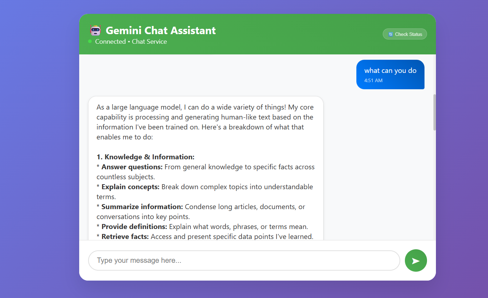
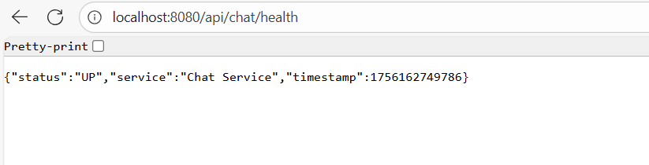

# 🤖 Spring Gemini Chat

A modern, reactive Spring Boot application that integrates with Google's Gemini AI to provide intelligent chat capabilities. Built with Spring WebFlux for high-performance, non-blocking operations and featuring a clean, responsive web interface.

## 📸 Screenshots

### Chat Interface

*Modern, responsive chat UI with real-time messaging*

### API Response Example

*JSON response structure from the Gemini integration*

### Health Check Dashboard

*Backend status and monitoring*

---

## ✨ Features

- 🚀 **Reactive Programming** - Built with Spring WebFlux for non-blocking operations
- 🤖 **Gemini AI Integration** - Powered by Google's latest Gemini AI model
- 💬 **Real-time Chat** - Instant responses with typing indicators
- 🎨 **Modern UI** - Clean, responsive web interface
- 📱 **Mobile Friendly** - Works seamlessly on all devices
- 🔄 **Health Monitoring** - Built-in health checks and status indicators
- 🛡️ **Error Handling** - Comprehensive error handling and validation
- ⚡ **High Performance** - Optimized for speed and scalability
- 🔧 **Easy Configuration** - Environment-based configuration
- 📊 **Conversation Context** - Support for contextual conversations

## 🛠️ Technology Stack

### Backend
- **Java 17** - Programming language
- **Spring Boot 3.1.5** - Application framework
- **Spring WebFlux** - Reactive programming
- **Spring Validation** - Input validation
- **Maven** - Dependency management
- **Google Gemini AI** - AI language model

### Frontend
- **HTML5** - Structure
- **CSS3** - Styling with modern animations
- **Vanilla JavaScript** - Interactive functionality
- **Fetch API** - HTTP requests

## 📋 Prerequisites

Before you begin, ensure you have the following installed:

- ☑️ **Java 17 or higher**
- ☑️ **Maven 3.6+**
- ☑️ **Git**
- ☑️ **Google Gemini API Key** ([Get it here](https://makersuite.google.com/app/apikey))

## 🚀 Quick Start

### 1. Clone the Repository
```bash
git clone https://github.com/yourusername/spring-gemini-chat.git
cd spring-gemini-chat
```

### 2. Set Environment Variables
```bash
# Windows
set GEMINI_API_KEY=your_actual_gemini_api_key_here

# macOS/Linux
export GEMINI_API_KEY=your_actual_gemini_api_key_here
```

### 3. Build and Run
```bash
# Clean and install dependencies
mvn clean install

# Run the application
mvn spring-boot:run
```

### 4. Access the Application
- **Backend API**: http://localhost:8080
- **Health Check**: http://localhost:8080/api/chat/health
- **Frontend UI**: Open `chat-ui.html` in your browser

## 📚 API Documentation

### Base URL
```
http://localhost:8080/api/chat
```

### Endpoints

#### 💬 Send Message
```http
POST /message
Content-Type: application/json

{
  "message": "Hello, how are you?"
}
```

**Response:**
```json
{
  "response": "I'm doing well, thank you for asking! How can I help you today?",
  "success": true,
  "error": null,
  "timestamp": 1692994488297
}
```

#### 🗣️ Conversation with Context
```http
POST /conversation
Content-Type: application/json

{
  "messages": [
    {
      "role": "user",
      "content": "What is Spring Boot?"
    },
    {
      "role": "assistant", 
      "content": "Spring Boot is a Java framework..."
    },
    {
      "role": "user",
      "content": "Can you give me an example?"
    }
  ]
}
```

#### 📡 Streaming Response
```http
POST /stream
Content-Type: application/json

{
  "message": "Tell me a story"
}
```

#### 🔍 Health Check
```http
GET /health
```

**Response:**
```json
{
  "status": "UP",
  "service": "Chat Service", 
  "timestamp": 1692994488297
}
```

## ⚙️ Configuration

### Application Properties
```properties
# Server Configuration
server.port=8080

# Gemini AI Configuration
gemini.api.key=${GEMINI_API_KEY:your-api-key-here}
gemini.api.base-url=https://generativelanguage.googleapis.com/v1beta/models
gemini.api.model=gemini-1.5-flash
gemini.api.timeout=30000

# CORS Configuration
cors.allowed-origins=http://localhost:3000,http://localhost:8080
```

### Environment Variables
| Variable | Description | Required | Default |
|----------|-------------|----------|---------|
| `GEMINI_API_KEY` | Your Google Gemini API key | ✅ Yes | - |
| `SERVER_PORT` | Server port | ❌ No | 8080 |
| `GEMINI_MODEL` | Gemini model to use | ❌ No | gemini-1.5-flash |

## 🧪 Testing

### Run Unit Tests
```bash
mvn test
```

### Run Integration Tests
```bash
mvn verify
```

### Manual Testing with cURL

**Windows Command Prompt:**
```cmd
curl -X POST http://localhost:8080/api/chat/message -H "Content-Type: application/json" -d "{\"message\": \"Hello!\"}"
```

**PowerShell/Linux/macOS:**
```bash
curl -X POST http://localhost:8080/api/chat/message \
  -H "Content-Type: application/json" \
  -d '{"message": "Hello!"}'
```

## 🏗️ Project Structure

```
spring-gemini-chat/
├── src/
│   ├── main/
│   │   ├── java/com/example/p1/
│   │   │   ├── P1Application.java           # Main application
│   │   │   ├── config/
│   │   │   │   └── AiConfiguration.java     # Configuration
│   │   │   ├── controller/
│   │   │   │   └── ChatController.java      # REST endpoints
│   │   │   └── service/
│   │   │       └── ChatService.java         # Business logic
│   │   └── resources/
│   │       └── application.properties       # Configuration
│   └── test/
│       └── java/com/example/p1/
│               └── P1ApplicationTests.java 
├── index.html                            # Frontend interface
├── screenshots/                            # UI screenshots
├── pom.xml                                 # Maven configuration
└── README.md                              # This file
```

## 🚀 Deployment

### Using Docker
```dockerfile
FROM openjdk:17-jdk-slim
COPY target/*.jar app.jar
EXPOSE 8080
ENTRYPOINT ["java","-jar","/app.jar"]
```

```bash
# Build the application
mvn clean package

# Build Docker image
docker build -t spring-gemini-chat .

# Run container
docker run -p 8080:8080 -e GEMINI_API_KEY=your_key spring-gemini-chat
```

### Using JAR
```bash
# Build JAR
mvn clean package

# Run JAR
java -jar target/p1-0.0.1-SNAPSHOT.jar
```

## 🤝 Contributing

We welcome contributions! Please follow these steps:

1. **Fork the repository**
2. **Create a feature branch** (`git checkout -b feature/amazing-feature`)
3. **Commit your changes** (`git commit -m 'Add some amazing feature'`)
4. **Push to the branch** (`git push origin feature/amazing-feature`)
5. **Open a Pull Request**

### Development Guidelines
- Follow Java coding conventions
- Write unit tests for new features
- Update documentation for API changes
- Use meaningful commit messages

## 🐛 Troubleshooting

### Common Issues

**❌ "Connection failed" in UI**
- Ensure backend is running on port 8080
- Check CORS configuration
- Verify network connectivity

**❌ "API key not found" error**
- Set GEMINI_API_KEY environment variable
- Restart the application after setting the key
- Verify the API key is valid

**❌ Maven build fails**
- Check Java version (requires Java 17+)
- Clear Maven cache: `mvn clean`
- Update dependencies: `mvn dependency:resolve -U`

**❌ CORS errors**
- Check allowed origins in `AiConfiguration.java`
- Verify frontend URL matches CORS settings

## 📄 License

This project is licensed under the MIT License - see the [LICENSE](LICENSE) file for details.

## 🙏 Acknowledgments

- **Google Gemini AI** - For providing the AI capabilities
- **Spring Team** - For the excellent Spring Boot framework
- **Contributors** - Thanks to all who contribute to this project

## 📞 Support

- 📧 **Email**: aniket21stcentury@gmail.com
- 🐛 **Issues**: [GitHub Issues](https://github.com/aniketqw/spring-gemini-chat/issues)
- 💬 **Discussions**: [GitHub Discussions](https://github.com/aniketqw/spring-gemini-chat/discussions)

---

